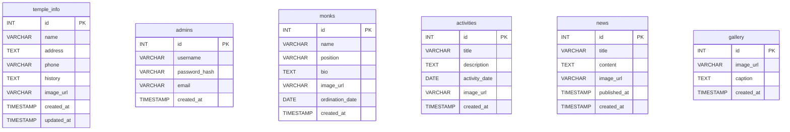

# Watnaku Temple Management API

A RESTful backend API for managing information for Wat Nakhumothanamai Punyaram (Wat Naku), built with **Node.js, Express 5, and MySQL**.

This service provides comprehensive management for temple information, monks, activities, news announcements, and an image gallery, complete with JWT authentication, custom request validation, and multipart image upload handling.

Repository: [PywrksBook/website-watnaku-backend-v1](https://github.com/PywrksBook/website-watnaku-backend-v1)

---

## Project Status

- **Backend (this repository):** Completed and ready for use ✅
- **Frontend:** Planned as a separate repository 🔜

---

## Built With (Tech Stack)

| Layer | Technology | Description |
|---|---|---|
| Runtime | Node.js (v20+) | JavaScript runtime environment |
| Framework | Express.js 5 | Minimalist web framework for Node.js |
| Database | MySQL | Relational database via `mysql2/promise` with Connection Pool |
| Authentication | JSON Web Token (`jsonwebtoken`) | Stateless token-based authentication |
| Security | `bcrypt` | Password hashing (salt rounds = 10) |
| File Upload | `multer` | Multipart file upload handler (5 MB max) |
| Environment | `dotenv` | Environment variable configuration |
| Development | `nodemon` | Auto-restarting development server |
| Other | `cors`, `express.static` | Cross-Origin Resource Sharing & static image serving at `/uploads` |

---

## Project Structure

```
website-watnaku-backend-v1/
├── src/
│   ├── config/
│   │   └── database.js        # MySQL connection pool setup & connectivity check
│   ├── controllers/
│   │   ├── activityController.js  # Activity management logic
│   │   ├── authController.js      # Admin authentication (login, getMe)
│   │   ├── galleryController.js   # Image gallery management logic
│   │   ├── monkController.js      # Monk records management logic
│   │   ├── newsController.js      # News announcements management logic
│   │   └── templeController.js    # Temple general information logic
│   ├── middleware/
│   │   ├── auth.js            # JWT Bearer Token verification
│   │   ├── errorHandler.js    # Centralized error handler (404, DB, JWT, Multer)
│   │   ├── upload.js          # Multer storage configuration (5MB, field "image")
│   │   └── validation.js      # Custom input validation middleware
│   ├── models/
│   │   ├── activityModel.js   # SQL queries for activities table
│   │   ├── adminModel.js      # SQL queries for admins table
│   │   ├── galleryModel.js    # SQL queries for gallery table
│   │   ├── monkModel.js       # SQL queries for monks table
│   │   ├── newsModel.js       # SQL queries for news table
│   │   └── templeModel.js     # SQL queries for temple_info table
│   ├── routes/
│   │   ├── activityRoutes.js  # Activity routes (/api/v1/activities)
│   │   ├── authRoutes.js      # Auth routes (/api/v1/auth)
│   │   ├── galleryRoutes.js   # Gallery routes (/api/v1/gallery)
│   │   ├── monkRoutes.js      # Monk routes (/api/v1/monks)
│   │   ├── newsRoutes.js      # News routes (/api/v1/news)
│   │   └── templeRoutes.js    # Temple info routes (/api/v1/temple)
│   └── server.js              # Application entry point, middlewares & routes mounting
├── uploads/                   # Uploaded image directory (.gitkeep)
├── .env.example               # Template environment variables
├── .gitignore
├── package-lock.json
├── package.json
└── schema.sql                 # Database DDL schema and initial seed data
```

---

## Getting Started

Follow these steps to get a local development environment running.

### Prerequisites

- **Node.js** (v20 or higher) → Check with `node -v`
- **npm** (bundled with Node.js) → Check with `npm -v`
- **MySQL** (8.0+ or MariaDB 10.5+)

### Installation

1. Clone the repository:
   ```bash
   git clone https://github.com/PywrksBook/website-watnaku-backend-v1.git
   cd website-watnaku-backend-v1
   ```

2. Install dependencies:
   ```bash
   npm install
   ```

### Environment Configuration

1. Copy the example configuration file:
   ```bash
   # Windows:
   copy .env.example .env

   # macOS / Linux:
   cp .env.example .env
   ```

2. Edit `.env` with your preferred editor and update database credentials:
   ```env
   PORT=3000
   NODE_ENV=development

   DB_HOST=localhost
   DB_USER=root
   DB_PASSWORD=your_mysql_password
   DB_NAME=watnaku_db

   JWT_SECRET=change_this_to_a_long_random_secret_string
   JWT_EXPIRES_IN=1d

   UPLOAD_DIR=uploads
   MAX_FILE_SIZE=5242880
   ```
> ⚠️ **Do not commit `.env` to version control.** Ensure `JWT_SECRET` is set to a secure string.

### Database Setup

Run the schema script to create the database, tables, and seed data:

```bash
mysql -u root -p < schema.sql
```

> 💡 **Notes for Windows Users:**
> - The `<` redirection syntax does not work in PowerShell. Use **Command Prompt (cmd)** instead, or log into the MySQL CLI (`mysql -u root -p`) and run `source schema.sql;`, or import `schema.sql` via **phpMyAdmin / MySQL Workbench**.
> - The `curl` command examples in this document use standard Bash line breaks (`\`). In PowerShell or CMD, consider using **Postman** or **Git Bash** to execute them directly.

---

## Creating an Admin Account

The database schema intentionally does not include a default admin account. Create your initial admin account using the following steps:

### Step 1: Generate a bcrypt Password Hash

Run this command in your project root:

```bash
node -e "console.log(require('bcrypt').hashSync('your-password', 10))"
```
Copy the generated hash string (e.g. `$2b$10$...`).

### Step 2: Insert the Admin Record

Execute this SQL query using MySQL CLI, Workbench, or phpMyAdmin:

```sql
USE watnaku_db;
INSERT INTO admins (username, password_hash, email)
VALUES ('admin', '<paste_your_bcrypt_hash_here>', 'admin@watnaku.com');
```

### Step 3: Verify Login

Start the server and test logging in with your new admin credentials (see [Authentication & Login](#authentication--login) below).

---

## Running the Application

```bash
npm run dev     # Starts development server with nodemon (auto-reloads on file changes)
# or
npm start       # Starts production server with node
```

Upon a successful startup, you will see:

```
===========================================
🚀 Watnaku Temple Management API
===========================================
📡 Server running on: http://localhost:3000
📊 Health check: http://localhost:3000/api/v1/health
🔐 Auth API: http://localhost:3000/api/v1/auth
🏛️  Temple API: http://localhost:3000/api/v1/temple
👤 Monks API: http://localhost:3000/api/v1/monks
📅 Activities API: http://localhost:3000/api/v1/activities
📰 News API: http://localhost:3000/api/v1/news
🖼️  Gallery API: http://localhost:3000/api/v1/gallery
🌍 Environment: development
===========================================
```

---

## Health Check

Verify that the server is active:

```bash
curl http://localhost:3000/api/v1/health
```

Expected Response (`200 OK`):
```json
{
  "success": true,
  "message": "Server is running!",
  "timestamp": "2026-09-21T01:30:00.000Z",
  "environment": "development"
}
```

---

## Authentication & Login

```bash
curl -X POST http://localhost:3000/api/v1/auth/login \
  -H "Content-Type: application/json" \
  -d '{"username":"admin","password":"your-password"}'
```

Successful Response (`200 OK`):
```json
{
  "success": true,
  "message": "เข้าสู่ระบบสำเร็จ",
  "data": {
    "id": 1,
    "username": "admin",
    "email": "admin@watnaku.com"
  },
  "token": "eyJhbGciOiJIUzI1NiIsInR5cCI6IkpXVCJ9..."
}
```

### Using the Bearer Token

For all protected endpoints, attach the token in the request header:
```
Authorization: Bearer <your_token>
```

---

## API Endpoints

> 📌 Base URL: `http://localhost:3000`  
> 📌 `🔐` denotes an endpoint requiring a valid JWT Bearer Token.

| Category | Method | URL | Access | Description |
|---|---|---|---|---|
| **Health** | GET | `/api/v1/health` | Public | Check server health status |
| **Auth** | POST | `/api/v1/auth/login` | Public | Admin login & token generation |
| **Auth** | GET | `/api/v1/auth/me` | 🔐 | Retrieve current admin profile |
| **Temple** | GET | `/api/v1/temple` | Public | Get general temple information |
| **Temple** | PUT | `/api/v1/temple` | 🔐 + Image | Update temple information |
| **Monks** | GET | `/api/v1/monks` | Public | List all monks |
| **Monks** | GET | `/api/v1/monks/:id` | Public | Get monk details by ID |
| **Monks** | POST | `/api/v1/monks` | 🔐 + Image | Add a new monk record |
| **Monks** | PUT | `/api/v1/monks/:id` | 🔐 + Image | Update monk details |
| **Monks** | DELETE | `/api/v1/monks/:id` | 🔐 | Delete monk record |
| **Activities** | GET | `/api/v1/activities` | Public | List all activities |
| **Activities** | GET | `/api/v1/activities/:id` | Public | Get activity details by ID |
| **Activities** | POST | `/api/v1/activities` | 🔐 + Image | Create a new activity |
| **Activities** | PUT | `/api/v1/activities/:id` | 🔐 + Image | Update activity details |
| **Activities** | DELETE | `/api/v1/activities/:id` | 🔐 | Delete activity record |
| **News** | GET | `/api/v1/news` | Public | List all news announcements |
| **News** | GET | `/api/v1/news/:id` | Public | Get news announcement by ID |
| **News** | POST | `/api/v1/news` | 🔐 + Image | Publish a news announcement |
| **News** | PUT | `/api/v1/news/:id` | 🔐 + Image | Update news announcement |
| **News** | DELETE | `/api/v1/news/:id` | 🔐 | Delete news announcement |
| **Gallery** | GET | `/api/v1/gallery` | Public | List all gallery photos |
| **Gallery** | GET | `/api/v1/gallery/:id` | Public | Get gallery photo by ID |
| **Gallery** | POST | `/api/v1/gallery` | 🔐 + Image | Upload a new gallery photo |
| **Gallery** | PUT | `/api/v1/gallery/:id` | 🔐 + Image | Update caption or photo |
| **Gallery** | DELETE | `/api/v1/gallery/:id` | 🔐 | Delete gallery photo |

---

## Request Payloads

The API accepts two content types depending on whether a file is uploaded:
- **`application/json`**: For standard JSON requests without file uploads.
- **`multipart/form-data`**: For requests uploading an image (file field name: `image`).

### Module Field Summary

| Category | Method | Required Fields | Optional Fields | File Upload |
|---|---|---|---|:---:|
| **Auth** | POST `/auth/login` | `username`, `password` | — | ❌ |
| **Temple** | PUT `/temple` | `name` (≤200), `address` | `phone`, `history`, `image_url` | ✅ |
| **Monks** | POST / PUT `/monks` | `name` (≤200) | `position` (≤100), `bio`, `ordination_date` (`YYYY-MM-DD`), `image_url` | ✅ |
| **Activities** | POST / PUT `/activities` | `title` (≤255) | `description`, `activity_date` (`YYYY-MM-DD`), `image_url` | ✅ |
| **News** | POST / PUT `/news` | `title` (≤255), `content` | `image_url` | ✅ |
| **Gallery** | POST / PUT `/gallery` | `image` (file) or `image_url` (URL) | `caption` | ✅ |

> ⚠️ **Key Update (PUT) Rules:**
> - **Gallery:** Either `image` (file) or `image_url` (URL) must always be supplied for both POST and PUT.
> - **Image Retention:** If a PUT request is sent without a new image file and without the existing `image_url` string, the database record will overwrite `image_url` with `NULL` (the image will disappear from listings, though the physical file remains on disk). To retain the existing image, pass the previous `image_url` string in the body.
> - **Required Fields:** PUT requests require the same mandatory fields as POST (e.g., `name`, `title`).

**Example Request (`POST /api/v1/monks`):**
```bash
curl -X POST http://localhost:3000/api/v1/monks \
  -H "Authorization: Bearer YOUR_TOKEN" \
  -F "name=พระมหาสมชาย จิตตสุภโร" \
  -F "position=รองเจ้าอาวาส" \
  -F "bio=เปรียญธรรม 5 ประโยค" \
  -F "ordination_date=1995-08-22" \
  -F "image=@/path/to/monk.jpg"
```

**Example Response (`201 Created`):**
```json
{
  "success": true,
  "message": "เพิ่มข้อมูลพระสงฆ์สำเร็จ",
  "data": {
    "id": 4,
    "name": "พระมหาสมชาย จิตตสุภโร",
    "position": "รองเจ้าอาวาส",
    "bio": "เปรียญธรรม 5 ประโยค",
    "image_url": "/uploads/image-1726884000000-584930219.jpg",
    "ordination_date": "1995-08-21T17:00:00.000Z",
    "created_at": "2026-09-21T01:30:00.000Z"
  }
}
```

> 💡 **Notes:**
> - MySQL `DATE` fields (`ordination_date`, `activity_date`) are parsed into JavaScript `Date` objects by `mysql2`, returning ISO 8601 UTC timestamps in JSON serialization.
> - Uploaded files are automatically renamed with an `image-<timestamp_ms>-<random>.<ext>` pattern to prevent filename collisions.

---

## File Uploads

The service handles multipart image uploads via Multer under the field name `image`:
- **Allowed MIME types:** `.jpg`, `.jpeg`, `.png`, `.gif`, `.webp` (up to 5 MB per `MAX_FILE_SIZE`).
- **Storage directory:** Saved locally in the `uploads/` directory on the server.
- **Direct access:** Served statically at `http://localhost:3000/uploads/<filename>`.

---

## Security

- **Authentication:** Stateless JSON Web Token (JWT) verification via `Authorization: Bearer <token>`, with expiration configured via `JWT_EXPIRES_IN` (default: 1 day).
- **Password Hashing:** Passwords hashed with `bcrypt` (10 salt rounds) before database storage.
- **SQL Injection Defense:** All models use Parameterized Queries (`?` placeholders) with `mysql2/promise`.
- **Route Authorization:**
  - **Protected Endpoints (🔐):** All state-modifying requests (`POST`, `PUT`, `DELETE`) across content modules, plus `GET /api/v1/auth/me`.
  - **Public Endpoints:** Read operations (`GET`), health check, and `POST /api/v1/auth/login`.

---

## Error Handling

All errors are handled through centralized middleware (`errorHandler.js`), providing consistent JSON responses:

```json
{
  "success": false,
  "error": "Descriptive error message",
  "details": ["Additional error details (e.g. input validation errors)"]
}
```

### Primary HTTP Status Codes

| HTTP Status | Meaning | Typical Scenario |
|---|---|---|
| **400 Bad Request** | Invalid request payload | Validation failures, duplicate unique keys (`ER_DUP_ENTRY`), foreign key issues, or file exceeding 5 MB |
| **401 Unauthorized** | Authentication failed | Missing token, non-Bearer header, invalid/expired token, or incorrect login credentials |
| **404 Not Found** | Resource not found | Unmatched route or record ID does not exist in database |
| **500 Internal Server Error** | Server-side error | Unhandled application errors or uploading a non-image file |
| **503 Service Unavailable** | Database unavailable | Server cannot connect to the MySQL database (`ECONNREFUSED`) |

---

## Database Schema

Database Name: `watnaku_db` (6 tables)

| Table | Primary Key | Foreign Key | Key Columns |
|---|---|---|---|
| `temple_info` | `id` (INT, CHECK id=1) | — | name, address, phone, history, image_url |
| `admins` | `id` (AUTO_INCREMENT) | — | username (UNIQUE), password_hash, email (UNIQUE) |
| `monks` | `id` (AUTO_INCREMENT) | — | name, position, bio, image_url, ordination_date |
| `activities` | `id` (AUTO_INCREMENT) | — | title, description, activity_date, image_url |
| `news` | `id` (AUTO_INCREMENT) | — | title, content, image_url, published_at |
| `gallery` | `id` (AUTO_INCREMENT) | — | image_url (NOT NULL), caption |

### Entity-Relationship Diagram



---

## Testing the API

You can test the endpoints using **Postman** or **curl**. Recommended testing sequence:

1. Verify server health: `GET /api/v1/health`
2. Fetch public resources without authentication: `GET /api/v1/monks`
3. Attempt creating a resource without a token: Expect `401 Unauthorized`
4. Log in to obtain a JWT token (`POST /api/v1/auth/login`), then retry with `Authorization: Bearer <token>`

---

## Known Limitations

1. **Single-tier Admin (No Role-based Access Control):** The `admins` table has no `role` column. All authenticated administrators possess identical permissions to create, update, and delete resources.
2. **No Pagination on List Endpoints:** Collection endpoints (`GET /api/v1/monks`, `activities`, `news`, `gallery`) return all rows in a single query (`SELECT *`) without `page` or `limit` query parameters.
3. **No Automated Test Suites:** The project does not currently have automated unit or integration tests (e.g. Jest or Supertest). Testing is performed manually via Postman or curl.
4. **No Rate Limiting:** No rate limiting middleware (such as `express-rate-limit`) is installed on endpoints like `POST /api/v1/auth/login`.
5. **No Orphaned File Cleanup:** Updating a resource with a new image (PUT) or deleting a record (DELETE) updates or removes database entries, but does not delete physical image files from the `uploads/` directory on disk.

---

## Author

- **Piyawat Reangraksa** — Full Backend Architecture, Database Design & API Implementation
- GitHub: [@PywrksBook](https://github.com/PywrksBook)
- Repository: [PywrksBook/website-watnaku-backend-v1](https://github.com/PywrksBook/website-watnaku-backend-v1)

---

## License

Developed by Piyawat Reangraksa for Wat Nakhumothanamai Punyaram.  
All rights reserved — Source code is available for educational inspection only. Unauthorized commercial use is strictly prohibited.
